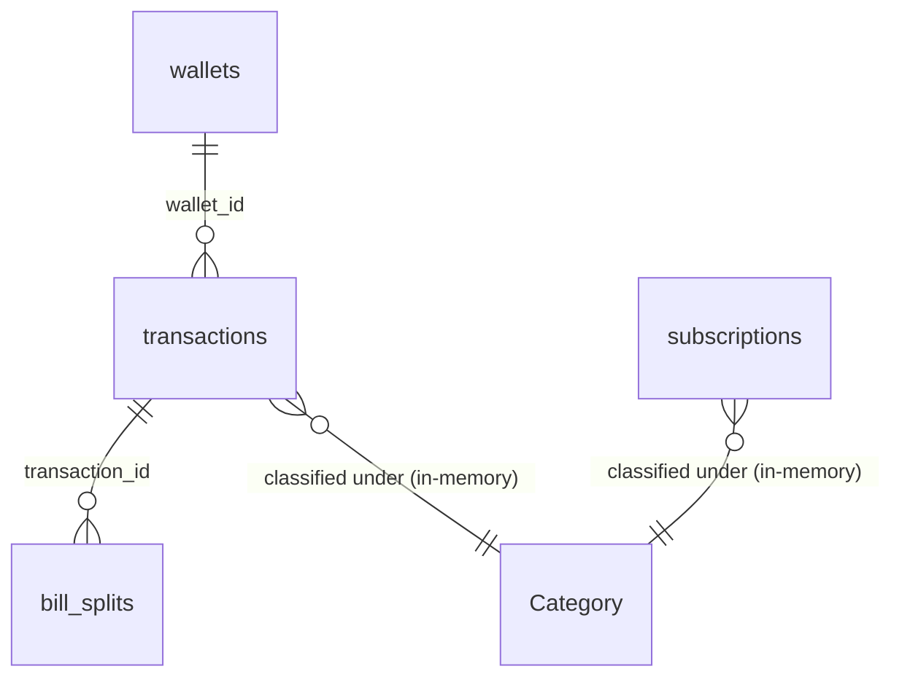

# Data Model: Baseline Specification

Tài liệu này định nghĩa cấu trúc lưu trữ dữ liệu cục bộ của NotePay (bao gồm cơ sở dữ liệu Room SQLite và SharedPreferences).

---

## 1. Cơ sở dữ liệu cục bộ (Room SQLite Entities)

Toàn bộ các số tiền (số dư, hạn mức, trị giá giao dịch) đều được lưu dưới dạng số nguyên cents (`Long` - ví dụ: $10.00 được lưu dưới dạng `1000L`) để ngăn ngừa sai số làm tròn số học dấu phẩy động.

### WalletEntity (Bảng: `wallets`)
Lưu trữ thông tin về ví/tài khoản tài chính của người dùng.
* `id`: `Long` (Primary Key, Auto-generate)
* `name`: `String` (Tên ví, ví dụ: "Tiền mặt", "Vietcombank")
* `initial_balance_cents`: `Long` (Số dư ban đầu bằng cents)
* `icon_key`: `String` (Mã định danh icon)
* `color_key`: `String` (Mã màu hiển thị)
* `is_active`: `Boolean` (Xác định ví hoạt động chính, chỉ có tối đa 1 ví active tại một thời điểm)
* `budget_limit_cents`: `Long?` (Hạn mức chi tiêu tháng tùy chọn của ví, `null` nếu không đặt hạn mức)
* `linked_package_name`: `String?` (Tên gói ứng dụng liên kết để nhận diện thông báo từ app ngân hàng/ví tương ứng)
* `bank_bin`: `String?` (Mã BIN ngân hàng liên kết)
* `account_number`: `String?` (Số tài khoản ngân hàng liên kết)
* `account_name`: `String?` (Tên tài khoản ngân hàng liên kết)
* `created_at`: `Long` (Thời gian khởi tạo, Epoch Milliseconds)

### TransactionEntity (Bảng: `transactions`)
Ghi nhận các giao dịch thu/chi hoặc chuyển tiền nội bộ.
* `id`: `Long` (Primary Key, Auto-generate)
* `amount_cents`: `Long` (Giá trị giao dịch, bắt buộc > 0)
* `type`: `String` (Loại giao dịch: `EXPENSE`, `INCOME`, `TRANSFER`)
* `category`: `String` (Mã định danh chuỗi danh mục, ví dụ: "FOOD", "COFFEE")
* `note`: `String` (Ghi chú giao dịch)
* `occurred_at`: `Long` (Thời gian phát sinh giao dịch, Epoch Milliseconds)
* `wallet_id`: `Long` (Foreign Key -> wallets.id ON DELETE CASCADE)
* `created_at`: `Long` (Thời gian bản ghi được tạo)
* `is_auto_capture`: `Boolean` (Đánh dấu giao dịch tự động nhận diện từ thông báo ngân hàng)
* `is_internal_transfer`: `Boolean` (Đánh dấu giao dịch luân chuyển nội bộ để loại trừ tính trùng trong thống kê chi tiêu)

### SubscriptionEntity (Bảng: `subscriptions`)
Lưu trữ thông tin về các gói dịch vụ/hóa đơn định kỳ cần nhắc nhở.
* `id`: `Long` (Primary Key, Auto-generate)
* `name`: `String` (Tên gói đăng ký, ví dụ: "Netflix", "Spotify")
* `amount_cents`: `Long` (Số tiền định kỳ bằng cents)
* `category`: `String` (Mã danh mục liên kết)
* `next_due_date`: `Long` (Thời điểm đến hạn tiếp theo, Epoch Milliseconds)
* `repeat_months`: `Int` (Chu kỳ lặp lại theo tháng, ví dụ: 1, 3, 6, 12)
* `remind_days_before`: `Int` (Số ngày thông báo nhắc nhở trước ngày đến hạn, ví dụ: 1, 2, 3, 7)
* `note`: `String` (Ghi chú gói dịch vụ)
* `is_active`: `Boolean` (Đánh dấu trạng thái nhắc nhở hoạt động)
* `created_at`: `Long` (Thời điểm tạo bản ghi)

### BillSplitEntity (Bảng: `bill_splits`)
Ghi nhận việc chia tiền hóa đơn chung với bạn bè.
* `id`: `Long` (Primary Key, Auto-generate)
* `transaction_id`: `Long` (Foreign Key -> transactions.id ON DELETE CASCADE)
* `debtor_name`: `String` (Tên người nợ tiền)
* `amount_cents`: `Long` (Số tiền cần thanh toán nợ bằng cents)
* `is_paid`: `Boolean` (Xác định người đó đã trả nợ hay chưa)
* `memo_code`: `String` (Mã nội dung ghi chú chuyển khoản nhận diện thanh toán tự động)
* `paid_at`: `Long?` (Thời điểm trả nợ, `null` nếu chưa trả)
* `created_at`: `Long` (Thời điểm tạo giao dịch chia tiền)

---

## 2. Lưu trữ ngoài Room (SharedPreferences)

* **Danh mục tùy chỉnh (`Category`)**: Được quản lý thông qua khóa `notepay_custom_categories`. Khi ứng dụng khởi chạy, danh sách danh mục tùy chỉnh từ SharedPreferences được nạp vào bộ nhớ động ở lớp `Category`. Không cần bảng Room riêng để tối ưu hiệu suất truy vấn tĩnh của danh mục.

---

## 3. Sơ đồ thực thể quan hệ (ER Diagram)

