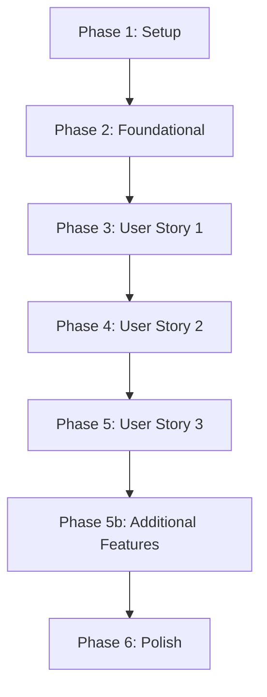

# Tasks: Baseline Specification

**Input**: Design documents from `specs/001-baseline-spec/`

**Prerequisites**: plan.md (required), spec.md (required), research.md, data-model.md, quickstart.md

**Organization**: Các tác vụ được sắp xếp theo từng giai đoạn để phản ánh kiến trúc thực tế của NotePay.

---

## Phase 1: Setup (Shared Infrastructure)

**Purpose**: Thiết lập cấu trúc cơ bản và cấu hình cho dự án NotePay.

- [x] T001 Create project package structure under app/src/main/java/com/notepay/
- [x] T002 Configure Room database dependencies and Hilt library in app/build.gradle.kts
- [x] T003 [P] Create application class NotePayApp.kt in app/src/main/java/com/notepay/

---

## Phase 2: Foundational (Blocking Prerequisites)

**Purpose**: Thiết lập các dịch vụ nền tảng dùng chung (Room DB, Notification Listener) trước khi triển khai các luồng nghiệp vụ.

- [x] T004 Define Room database class NotePayDatabase.kt in app/src/main/java/com/notepay/data/local/
- [x] T005 [P] Implement Android Notification Listener Service NotePayNotificationListenerService.kt in app/src/main/java/com/notepay/service/
- [x] T006 [P] Implement local bank notification text parser NotificationParser.kt in app/src/main/java/com/notepay/domain/notification/

---

## Phase 3: User Story 1 - Expense and Income Tracking (Priority: P1) 🎯 MVP

**Goal**: Theo dõi chi tiêu, thu nhập với đơn vị tiền tệ cơ sở duy nhất (Long cents).

### Implementation for User Story 1

- [x] T007 [P] [US1] Create domain models Wallet.kt, Transaction.kt, Category.kt in app/src/main/java/com/notepay/domain/model/
- [x] T008 [P] [US1] Create database entities WalletEntity.kt, TransactionEntity.kt in app/src/main/java/com/notepay/data/local/entity/ (Category uses SharedPreferences)
- [x] T009 [P] [US1] Create Room DAOs WalletDao.kt, TransactionDao.kt in app/src/main/java/com/notepay/data/local/dao/
- [x] T010 [US1] Create repository interfaces WalletRepository.kt, TransactionRepository.kt, CategoryRepository.kt in domain/repository/ and implement them in data/repository/
- [x] T011 [US1] Implement UseCases AddTransactionUseCase.kt, GetTransactionsUseCase.kt in app/src/main/java/com/notepay/domain/usecase/
- [x] T012 [US1] Create ViewModels TransactionListViewModel.kt and AddTransactionViewModel.kt in app/src/main/java/com/notepay/ui/feature/
- [x] T013 [US1] Implement transaction screens TransactionListScreen.kt and AddTransactionScreen.kt using Liquid Glass style in app/src/main/java/com/notepay/ui/feature/

---

## Phase 4: User Story 2 - Budget and Multi-Wallet Management (Priority: P1)

**Goal**: Quản lý nhiều ví và đặt hạn mức ngân sách trực tiếp trên ví.

### Implementation for User Story 2

- [x] T014 [P] [US2] Add budgetLimit field to Wallet.kt domain model
- [x] T015 [P] [US2] Add budget_limit_cents column to WalletEntity.kt and corresponding queries to WalletDao.kt
- [x] T016 [US2] Implement budget limit database operations within WalletRepositoryImpl.kt
- [x] T017 [US2] Implement Transfer flow inside AddTransactionViewModel.kt and NotePayNotificationListenerService.kt (internal transfer detection)
- [x] T018 [US2] Handle budget limit settings in AddWalletViewModel.kt and progress in StatsViewModel.kt
- [x] T019 [US2] Implement budget limit editing in AddWalletScreen.kt and visual progress bar in StatsScreen.kt

---

## Phase 5: User Story 3 - Local AI Insights and Analytics (Priority: P2)

**Goal**: Biểu đồ phân tích chi tiêu và gợi ý tài chính ngoại tuyến qua bộ máy luật StatsInsightsEngine.

### Implementation for User Story 3

- [x] T020 [P] [US3] Implement offline rules-based insights engine StatsInsightsEngine.kt in app/src/main/java/com/notepay/ui/feature/stats/
- [x] T021 [US3] Integrate StatsInsightsEngine analytics directly into StatsViewModel.kt
- [x] T022 [US3] Calculate budget advice, forecast, and dynamic daily budget inside StatsViewModel.kt
- [x] T023 [US3] Expose UI state Flow for charts and suggestions in StatsViewModel.kt
- [x] T024 [US3] Implement StatsScreen.kt with pie chart and AI insight cards using Liquid Glass style

---

## Phase 5b: Bill Splitting & Subscription Management (Additional Features)

**Goal**: Theo dõi chia tiền hóa đơn và quản lý nhắc nhở gói dịch vụ định kỳ.

- [x] T024a [US1] Create BillSplit domain model and Room entity BillSplitEntity.kt
- [x] T024b [US1] Create BillSplitDao.kt and BillSplitRepositoryImpl.kt
- [x] T024c [US1] Create Subscription domain model and Room entity SubscriptionEntity.kt
- [x] T024d [US1] Create SubscriptionDao.kt and SubscriptionRepositoryImpl.kt
- [x] T024e [US1] Implement SubscriptionScreen.kt and SubscriptionViewModel.kt (observing repository directly)
- [x] T024f [US1] Implement transaction frequency checking for subscriptions in StatsViewModel.kt and NotePayNotificationListenerService.kt

---

## Phase 6: Polish & Cross-Cutting Concerns

**Purpose**: Kiểm thử toàn diện, tối ưu hóa hiệu năng và rà soát chất lượng.

- [ ] T025 Run unit tests via ./gradlew testDebugUnitTest to verify database and MVVM logic
- [ ] T026 Run instrumentation tests via ./gradlew connectedAndroidTest to verify Liquid Glass UI
- [ ] T027 Verify background notification parsing service via adb notification post command
- [ ] T028 [P] Run static code analysis via ./gradlew lintDebug and resolve warnings
- [ ] T029 Run Android build packaging validation via ./gradlew assembleDebug

---

## Dependencies & Execution Order

### Phase Dependencies

