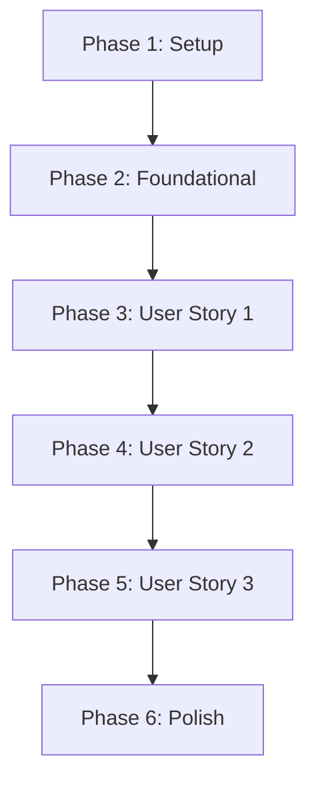

# Tasks: Liquid Glass UI v2

**Input**: Design documents from `specs/002-liquid-glass-ui-v2/`

**Prerequisites**: plan.md (required), spec.md (required for user stories), research.md, data-model.md, quickstart.md

**Organization**: Các tác vụ được chia nhỏ theo từng thành phần (component) và màn hình (screen) để đảm bảo tiến độ triển khai an toàn và dễ kiểm thử.

## Format: `[ID] [P?] [Story] Description`

- **[P]**: Có thể chạy song song (các tệp tin độc lập, không có xung đột mã nguồn)
- **[Story]**: Tương ứng với User Story trong spec.md (US1, US2, US3)

---

## Phase 1: Setup (Shared Infrastructure)

**Purpose**: Project initialization and basic structure

- [ ] T001 Configure project build environments for UI refinement in app/build.gradle.kts
- [ ] T002 [P] Verify existing theme definitions and color assets in app/src/main/java/com/notepay/ui/theme/Theme.kt

---

## Phase 2: Foundational (Blocking Prerequisites)

**Purpose**: Các thiết lập giao diện dùng chung làm nền tảng cho việc nâng cấp v2

**⚠️ CRITICAL**: Không thực hiện các tác vụ của User Story trước khi giai đoạn này hoàn thành.

- [ ] T003 [P] Refine glass card border stroke parameters in app/src/main/java/com/notepay/ui/component/BalanceCard.kt
- [ ] T004 [P] Implement hardware-performance and Android SDK checks for dynamic blur in app/src/main/java/com/notepay/ui/util/GlassEffectUtils.kt

**Checkpoint**: Nền tảng giao diện sẵn sàng - các tác vụ tinh chỉnh màn hình có thể bắt đầu chạy song song.

---

## Phase 3: User Story 1 - Unified Visual Hierarchy & Spacing (Priority: P1) 🎯 MVP

**Goal**: Đảm bảo toàn bộ ứng dụng sử dụng lưới khoảng cách 8dp thống nhất và phân cấp kiểu chữ rõ ràng.

**Independent Test**: Mở màn hình Home và AddTransaction, xác thực lề căn chỉnh thẳng hàng và cỡ chữ tiền tệ hiển thị nổi bật.

### Implementation for User Story 1

- [ ] T005 [P] [US1] Refine header spacing and title sizes in app/src/main/java/com/notepay/ui/feature/home/HomeScreen.kt
- [ ] T006 [P] [US1] Refine vertical paddings of list row items in app/src/main/java/com/notepay/ui/component/TransactionItem.kt
- [ ] T007 [P] [US1] Refine search bar padding and tab layout spacing in app/src/main/java/com/notepay/ui/feature/list/TransactionListScreen.kt
- [ ] T008 [P] [US1] Refine layout spacing of transaction input fields in app/src/main/java/com/notepay/ui/feature/addtransaction/AddTransactionScreen.kt
- [ ] T009 [P] [US1] Refine edit screen form heights and margins in app/src/main/java/com/notepay/ui/feature/addtransaction/EditTransactionScreen.kt
- [ ] T010 [P] [US1] Refine list item alignment in wallet bottom sheet in app/src/main/java/com/notepay/ui/feature/addtransaction/WalletPickerSheet.kt
- [ ] T011 [P] [US1] Refine icon grid padding and grid heights in app/src/main/java/com/notepay/ui/feature/addtransaction/CategoryGridPicker.kt

**Checkpoint**: Toàn bộ luồng ghi nhận giao dịch của User Story 1 đã được căn chỉnh lưới khoảng cách và phân cấp chữ hoàn chỉnh.

---

## Phase 4: User Story 2 - Smooth Glass Micro-animations (Priority: P2)

**Goal**: Triển khai các hiệu ứng chuyển động và tương tác mượt mà đạt tần số quét 60fps.

**Independent Test**: Tương tác chuyển đổi giữa các tab chính liên tục và chạm các nút bấm để kiểm tra hiệu ứng phản hồi xúc giác.

### Implementation for User Story 2

- [ ] T012 [P] [US2] Add slide and fade tab transition animations in app/src/main/java/com/notepay/ui/navigation/NotePayNavHost.kt
- [x] T013 [P] [US2] Implement press-down scale-down micro-animations in app/src/main/java/com/notepay/ui/component/LiquidButton.kt
- [ ] T014 [P] [US2] Refine slider thumb sliding animation curves in app/src/main/java/com/notepay/ui/component/LiquidSlider.kt
- [ ] T015 [P] [US2] Refine toggle selection indicator sliding transition in app/src/main/java/com/notepay/ui/component/LiquidToggle.kt
- [ ] T016 [P] [US2] Refine carousel card scrolling transition in app/src/main/java/com/notepay/ui/feature/stats/StatsScreen.kt

**Checkpoint**: Tất cả các tương tác chạm, trượt và chuyển màn hình đều có micro-animations mượt mà.

---

## Phase 5: User Story 3 - Premium Frosted Glass Effects (Priority: P3)

**Goal**: Nâng cao chất lượng hiệu ứng mờ nhòe kính frosted glass và độ tương phản hiển thị.

**Independent Test**: Mở các bottom sheet và dialog trên nền tối, xác thực hiệu ứng bóng mờ mịn và độ đọc chữ cao.

### Implementation for User Story 3

- [ ] T017 [P] [US3] Add frosted backdrop blur effect in app/src/main/java/com/notepay/ui/feature/subscription/AddSubscriptionBottomSheet.kt
- [ ] T018 [P] [US3] Refine transparency overlay of delete dialog in app/src/main/java/com/notepay/ui/component/ConfirmDeleteDialog.kt
- [ ] T019 [P] [US3] Refine background overlay glass blur in app/src/main/java/com/notepay/ui/feature/wallet/AddWalletScreen.kt
- [ ] T020 [P] [US3] Unify text contrast on top of frosted graph containers in app/src/main/java/com/notepay/ui/feature/stats/StatsScreen.kt

**Checkpoint**: Hiệu ứng kính Liquid Glass đạt chuẩn hiển thị cao cấp trên các màn hình có lớp phủ.

---

## Phase 6: Polish & Cross-Cutting Concerns

**Purpose**: Kiểm thử toàn diện, tối ưu hóa hiệu năng và rà soát chất lượng.

- [ ] T021 Run compilation check via ./gradlew compileDebugKotlin
- [ ] T022 Run unit tests via ./gradlew testDebugUnitTest to verify zero regression
- [ ] T023 Run static code analysis via ./gradlew lintDebug and resolve warnings
- [ ] T024 Run Android build packaging validation via ./gradlew assembleDebug
- [ ] T025 Run quickstart.md validation scenarios on target emulator

---

## Dependencies & Execution Order

### Phase Dependencies

---

## Parallel Opportunities

* Các tác vụ đánh dấu `[P]` hoạt động trên các tệp tin Compose độc lập có thể được sửa đổi đồng thời.
* Khi kết thúc giai đoạn Foundational, lập trình viên có thể làm việc song song trên User Story 1 (Spacings) và User Story 2 (Animations).

---

## Implementation Strategy

### MVP First (User Story 1 Only)

1. Hoàn thành **Setup (Phase 1)** và **Foundational (Phase 2)**.
2. Thực hiện tinh chỉnh Spacing & Hierarchy cho toàn bộ 6 màn hình chính ở **Phase 3 (User Story 1)**.
3. **STOP and VALIDATE**: Biên dịch và chạy thử trên thiết bị ảo để xác nhận lưới thiết kế chuẩn chỉ.

### Incremental Delivery

1. Cài đặt lưới Spacings thành công.
2. Thêm Micro-animations (Phase 4).
3. Nâng cấp bộ lọc Blur overlays (Phase 5).
4. Mỗi giai đoạn đều chạy kiểm thử tránh làm lỗi (regress) logic nghiệp vụ.
